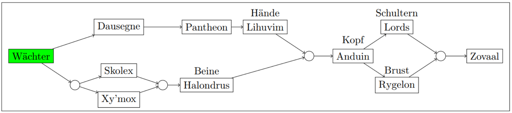

# Bossreihenfolge
- Aufmerksamer Wächter
- Dausegne (links)
- Prototypenpantheon
- Lihuvim
- Skolex (zurück, rechts, rechts)
- Xymox 
- Halondrus
- Anduin (zurück)

**AB WOCHE 2**
- Lords des Schreckens
- Rygelon
- Kerkermeister

# Verfügbare RaidCDs
Defs: 
- Darkness (3min/8s): Melidira
- Kuppel (2min/8s): Sotian
- Auramastery (3min/8s): Otspowner

Heals:
- Ashen: Trolldor (4min/30s) (nur im Notfall einplanen)
- Hymne: Shao(3min/8s)
- Hymne: Thiarey(3min/8s)
- Tranq: Blechmann(3min/8s)

# Aufmerksamer Wächter
- Sollte relativ einfach sein, nicht viele Mechaniken, aber Damagerace am Ende.
- 3 Phasen. (100%, 40%, 15%)
- Auch wenn viele Adds am Anfang da sind, wichtig ist das **Singletarget-Damagerace ab 15%**.

## Wichtige Mechaniken
- Ab 15% Damagerace
- Ab ~40% Pfeile überm Kopf
- Viel ausweichen

## Strategie
- P1: Alle Folgen Spieler mit Mark
- P2: Spreaden, dodgen und safe spielen
- P3: Damagerace -> **Kampfrausch**, ggf. große DMG cds bereithalten
- P3: Alle Mechaniken aus P2 fallen weg -> wieder stacken => heilen ist einfacher.

## Heiler
- HealCDs in P3
- Pulsierender Damage in 3s intervallen
- Wird alle 3s um 30% stärker

## RaidCDs ab 15%
Option 1:
-> Ashen + Kampfrausch
-> Darkness + Thiarey Hymne
-> Kuppel + Shao Hymne
-> Auramastery + Tranq

Option 2:
-> Ashen + Kampfrausch
-> Darkness + Thiarey Hymne + Shao Hymne
-> Kuppel + Auramastery + Tranq

# Dausegne
- Viel Movement
- Mehrere minidamageburns
- 1 Add abundzu im Fight da.
- **Kampfrausch** on pull

## Wichtige Mechaniken
### Schild
- Alle 2min dicker Raiddamage bis Schild gebrochen wird
- Raidcds hier rein
- DDs am besten so spielen, dass CDs damit alignen -> Heiler werden entlastet gerade bei Option 2 wichtig
- erster bei 1min10s, dann ca alle 2min

### Ringe
- Während dem Kampf kommen größer werdende Ringe
- Anfangs einer, pro Schildmechanik einer mehr
- Beim durchschreiten gibt es Debuff (ca 5s) -> Warten bis man den nächsten Ring durchschreitet sonst tot
- Am besten jeden zweiten Ring cheesen durch Teleports oder sonstiges. Seid kreativ!

### HC-Soaklinien
- Ähnlich wie P1 Sire Denathrius
- 2-3 Spieler müssen Soaken
- **Achtung**: Man kann nicht zwei mal hintereinander soaken! -> Spieler Rotieren.
- Ggf Spieler einteilen wenn doch zu chaotisch.
- Schattenschaden -> Vllt immuneable mal sehen

## Strategie
- Kurz vor einem Ring wird angesagt wo dieser kommt -> Raid bewegt sich beim ersten Ring da hin. Alle weiteren werden angesagt, aber spielerisches ermessen, wie das gehandhabt wird.
- **Tanks**: Cleve Add droppt Flächen -> Boss am Rand langsam langziehen oder in der mitte Flächen sammeln. Sehen wir dann was besser ist
- **Optional**: Frontal geht auf zufällige Spieler. Können wir durch stacken cheesen -> https://raidplan.io/plan/ZferuIGu2rx51vf3/ Warscheinlich aber besser einfach gespreadedt um den Boss stehen.

## RaidCDs
Option 1:
- ~1min 10s: Ashen-Trolldor + Kuppel-Sotian -> Darkness
- ~3min 10s: Tranq-Blechmann + Kuppel-Sotian  -> Doppelhymne + Auramastery-Otspowner
- ~5min 10s: Ashen-Trolldor + Kuppel-Sotian -> Darkness
- ~7min 10s: Tranq-Blechmann + Kuppel-Sotian  -> Doppelhymne + Auramastery-Otspowner
- ENRAGE -> TOT

Option 2:
- ~1min 10s: Hymne-Shao + Kuppel-Sotian -> Darkness + Hymne-Thiarey
- ~3min 10s: Tranq-Blechmann + Kuppel-Sotian  -> Auramastery-Otspowner + Heilerschweiß
- ~5min 10s: Hymne-Shao + Kuppel-Sotian -> Darkness + Hymne-Thiarey
- ~7min 10s: Tranq-Blechmann + Kuppel-Sotian  -> Auramastery-Otspowner + Heilerschweiß
- ENRAGE -> TOT

# Skolex
- Raidplan: https://raidplan.io/plan/ymLCmRiTrPIyXpAS/
- **Kampfrausch** on pull
- Schwierigkeit besteht in Debuffstackbalancing

## Wichtige Mechaniken
### Stackender Dot
- Raid bekommt durchgehend stackenden Dot
- Manche Spieler bekommen durch einige Mechaniken extra Stacks

### Stacks Abbauen
- Nie während Tankkombo!
- Alle Spieler stacken so eng wie möglich in einem Punkt
- Boss bewegt sich dann dahin
- Sobald Boss erscheint ist an dieser Stelle ein Gruppensoak, den **ALLE** soaken
- **Heiler** schon vorher in der Nähe des Marks aufhalten, damit während kritischer Phase nicht gelaufen werden muss. -> Tranq oder ähnliches ist dann einfacher
- Nach jedem abstacken macht der Boss insgesamt 5% mehr Damage
- Schwierigkeit besteht diese 2 Debuffs zu balancen

### Tankkombo
- **Tanks** müssen sich die anschauen, ist etwas komplizierter.
- **DDs/Heiler** auf HC bekommen die 3 am weitesten stehenden Spieler zusätzliche Staubstacks
- **DDs/Heiler** auf HC die 3 am weitesten stehenden Spieler fügen allen Spielern um sich rum zusatzschaden zu 

### Random Frontal
- Frontal geht in zufällige Richtung
- Ist **riesig**
- je näher am Boss, desto einfacher ausweichen
- Marks ignorieren, einfach weglaufen
- Nach Frontal zurück an Positionen

### Strategie
- Raidplan hat mehrere Seiten, anschauen für groben Kampfverlauf
- Alle loose in dem Kästchen stehen
- Kommt Tanksmash 3 Spieler mit wenig stacks auf 3 die 3 Marks
- Ab bestimmter Stackzahl **ALLE** in dem jeweils anderen Bossmark (Skull oder X) stacken
- Nach jedem Frontal entfernte Spieler wechseln
- Nach jedem zweiten Frontal Stacken

### Raidcds
- Dynamisch callen, weil Zeiten je nach Raidgruppe krass unterschiedlich sein können
- **Bitte Kommunizieren wer einen CD ziehen kann**
- Beispiel: "*Ich stell für den Soak ne Kuppel*", "*Ich zieh dann kurz vorm Soak Tranq*"
- **Vertraut euren Mitspielern**
- Heilerkritische Momente sind: Hohe Stacks kurz vor Soak und der Soak selbst. Dafür am besten Heilcds nutzen, aber gerne auch andere Vorschläge machen

# Prototypenpantheon
- Immer mindestens 2 Bosse aktiv, später 4 Bosse gleichzeitig
- Oft eine Hand voll Adds zusätzlich
- Denathrius revisited
- **Kampfrausch** P3 wenn alle 4 Bosse aktiv sind
- Extrem chaotischer Movementkampf
- Phasenwechsel wenn **einer** der Bosse 50% HP hat -> beide gleichzeitig auf 50% bringen
- **Heroisch** Wenn in P3 nicht alle innerhalb 20s sterben -> der tote Boss = 100% HP

## **P1** Wichtige Mechaniken 
### 4 Adds
- an 4 Ecken des Raums spawnen 4 Adds
- **Tanks** ziehen Bosse an das nächste Add, danach im Uhrzeigersinn zum nächsten
- **Melees** Cleven vom Add runter
- **Ranges** kümmern sich gegen den Uhrzeigersinn um die anderen Adds, die nicht gerade am Boss sind

### Random Dots
- **Heiler** nicht sofort dispellen
- **Betroffener Spieler** muss in Kuppel stehen sonst springt er auf anderen Spieler über
- Beim Dispell sterben alle anderen Spieler innerhalb 8 Metern vom betroffenen Spieler
- Kommunikation ist Schlüssel

### Wind
- **Heiler** 12s lang fetter Raiddamage -> HealCDs
- Ganzer Raid wird zur Seite gescubst
- Swirlies aufm Bodem -> Ausweichen

## **P2** Wichtige Mechaniken
### Hand der Zerstörung
- Alle werden zu Denathrius gezogen
- Spieler müssen rauslaufen, wie P2/P3 Denathrius -> **Movementcds** wie Roar o.ä.
- Nach heranziehen schießt jeder Spieler 4 Kugeln in Himmelsrichtungen von sich -> **SPREADEN**
- Wer von Kugeln getroffen wird bekommt Dot-Stack für den rest der Phase

### Tiere
- Es kommen sau viele Tiere durch den Raum gelaufen
- Machen Damage -> Aufmerksam bleiben und ausweichen

### Samen
- **Reine Heilermechanik**
- 4 Samen die geheilt werden können
- Verlieren konstant HP
- Samen tot = Raid bekommt dick schaden -> **Heiler** Samen am leben halten
- Samen vollgeheilt = Raid bekommt Healingbuff für 30s
- Healingbuff **stacked und refreshed** bei weiteren voll geheilten Samen
- **Optimalfall** Kurz vor auslaufen, des Buffs nächsten Samen vollheilen. **Kein Muss**, hauptsache Samen sterben nicht und es werden nicht instant mehrere gleichzeitig voll geheilt.
- Im Uhrzeigersinn vollheilen, beginnend von dem, der dem Raid am nächsten ist (ggf raidmark daneben, wenn nicht ersichtlich)

## **P3** Wichtige Mechaniken
- Totaler Abfuck
- **Alles** von P1 und P2 **gleichzeitig**
- 4 Bosse sind Aktiv

## Tanks
- **P1** Kyrianerboss hat ähnlichen Tanksmash wie das Auge aus dem Sanktum -> Schaden mitigieren, sonst leiden die Heiler/der Raid drunter
- **P2** Denathrius hat die Gleiche Tankmechahnik wie in Season 1, es muss/darf aber kein anderer Spieler getroffen werden -> vom Raid wegdrehen + Offtank darf nicht im Frontal stehen
- In **P3** mehr aufpassen, da Denathrius und Kyrianerboss gleichzeitig aktiv sind
- Die anderen 2 Bosse haben keine Tankmechaniken

## Heiler
- Der meiste Schaden kommt rein, wenn der Kyrianerboss alle für ~12s rumschubst -> Healcds, da frequenz noch nicht bekannt, dynamisch ansagen und **kommunizieren**

## Strategie
- Bosse so gut wie mögl. zusammenhalten/zu Adds ziehen
- Nie in der Mitte tanken, von da kommt ein haufen Mist in den Raid rein.
- **Alle Spieler** weit verteilt stehen.

# Xymox
- Sehr viel movement
- Individuelle Aufmerksamkeit ist gefordert
- **Kampfrausch** 2. Zwischenphase

## Wichtige Mechaniken
### Portale
- Eins auf nem Tank
- Eins auf nem zufälligen Spieler
- **Immer** ein Portal in die mitte des Raums und eins neben den Raid
- Ob Tank oder spieler wegbringt sehen wir dann

### Ringe
- Entweder von außen -> mitte oder Mitte -> außen. Kann man sehen am Artefakt in der Mitte
- Nicht berühren, brühren = tot
- Entweder Portale verwenden oder immunities/teleports

### Ranziehen
- Der Tanksmash zieht nach der Explosion Spieler in den explodierenden Tank
- Wird anstrengend wenn überlappung mit Ringen
- **Heiler** passiert ca. alle 60s, man sollte drauf vorbereitet sein

### Fallen/Traps
- Wie in Nathria
- Fallen auf einer Seite des Raids ablegen
- Auf HC können Fallen nicht gecleared werden -> Boss am Rand der arena im Uhrzeigersinn ziehen.

### Spread
- Spieler kriegen Ringe um sich
- Spreaden
- **Heiler** passiert ca. alle 30s, man sollte drauf vorbereitet sein.

## Zwischenphase
- bei ca 75% und bei ca 50%
- Boss immun, Adds kommen
- Phase ist um, wenn alle Adds tot sind
- Große Adds haben prio, cast zu ende -> Raid tot, nicht kickbar
- kleine Adds cleeven und kicken 
- **Heiler** hochstackender Raiddot -> Dicke CDs
- **Nach jeder Zwischenphase** kommt ein Ring mehr hintereinander bei einem Ringcast

## Strategie
- Boss am Rand tanken
- Boss wenn zu wenig Platz im Uhrzeigersinn rundziehen

### Overlaps
- sind ekelhaft
#### Ringe + Ranziehen
- Wenn **Ring nach innen** geht läuft der Raid weg und der Tank bleibt neben dem Portal stehen -> raid muss nur einmal laufen
- Wenn **Ring nach außen** alle so schnell wie möglich ins Portal und dann alle auseinander laufen

## Raidcds
- Ziehen wir am Anfang BL besteht, die Chance, dass wir das noch in der Zwischenphase 1 haben

### Zwischenphase 1
- Ab x Stacks
- Auramastery + Tranq
- Sotian Kuppel + Thiarey Hymne

### Zwischenphase 2
- Ab X Stacks nacheinander
- Darkness + Shao Hymne
- Kuppel und Tranq (falls wieder Ready)
- Auramastery + Thiarey Hymne (falls wieder Ready)

# Lihuvim
- Abwechselnd Bossphase, Addphase
- **Kampfrausch** on Pull -> Weniger Addphasen
- Raidplan: https://raidplan.io/plan/V_qeQPLMkSTCHh5_

## Wichtige Mechaniken Bossphase
- Fähigkeiten scheinen einen gewissen Rythmus zu haben

### Bomben
- Spieler werden Markiert, lassen Bomben fallen
- Werden Bomben aktiviert -> **riesige** Void
- Mark wird platziert, dadrin stacken, danach schnell rauslaufen -> **movement CDs**

### Ringe
- Wenige Spieler bekommen Ringe um sich rum -> Abstand von anderen Spielern
- Ringe können Bomben zerstören -> Versuchen immer alle Bomben zu zerstören

### Subser
- Bisschen Raidschaden
- Gesamter Raid wird zurückgeschoben
- **Nie** zwischen Boss und Bomben stehen

## Wichtige Mechaniken Addphase
- Wenn Boss 100% Energie erreicht startet Addphase
- Adds werden erst gebaut, bevor sie aktiv werden 
- Adds können getötet werden bevor sie aktiv werden (15s Zeit dafür)
- Danach Boss inaktiv für 30s **bekommt während dieser Phase dennoch 100% des Schadens** -> Adds in Boss ziehen
- Dauert die Phase zu lange kommt Boss wieder in den Kampf
- Mechanikenoverlapps könne dann ekelhaft werden
- Entscheiden, welche Mechaniken wir nicht mit dem Boss spielen wollen ist Schlüssel
- Es werden immer 4 Adds gebaut, es kann durchaus auch ein Add fehlen und dafür ein anderes Doppelt

### Akquisitions-Automat
- alle 5s raidweite Damageticks die stacken (nicht soo heftig, außer er lebt wirklich zu lange)
- fixiert Spieler und schubst alle zur seite, die er berührt -> Spieler kitet den um den Raid rum
- Bei tot werden alle Spieler (innerhalb 40m) weit weggeschubst und der raid bekommt ne moderate kelle -> So stehen, dass man nicht in Bomben geschubst wird

### Degenerations-Automat
- Ganz viele kleine auf einmal
- Casten auf zufällige Spieler -> viel Gruppenschaden
- Sind ccbar, aber nicht kickbar
- Runter AoEn

### Wächter-Automat
- spawned Adds, die nicht angreifbar sind und random Spieler angreifen
- zusatzadds sterben mit dem Wächter
- muss durchgeheilt werden

### Verteidigungs-Automat
- Setzt ein Schild um sich rum
- Jegliche Mobs im Schild **außer** der Verteidiger bekommen 50% weniger dmg
- Lösung: Entweder Mobs rausziehen oder Verteidiger runterfocussen

## Strategie
- Bossphase einfach Mechaniken richtig spielen
- Boss weg vom Raid
- Melees hinter den Boss
- Rangecamp bilden ein Stück hinter den melees
- Bomben werden auf halbem Weg rechts zwischen den Camps abgelegt (wird dynamisch markiert)
- Addphase 2 Gruppen je 1 Tank
- 2 Adds versuchen zu töten bevor sie gebaut werden
- Verbleibende Adds in den Boss ziehen

## Addpriorität
- einfach aus dem Bauch raus wollen wir nie Schubser (Akquisition) während dem Boss haben wegen präzisem Bombenplacement/-clearen
- Verteidiger zieht den Kampf in die Länge
- Wächter muss dann einfach gegen geheilt werden
- Die kleinen Vielen Adds sind ekelhaft, sollten aber schnell tot sein wenn sie spawnen
- Prio wie folgt:
1. Akquisitions-Automat
2. Verteidigungs-Automat
3. Degenerations-Automat
4. Wächter-Automat

## Heiler
- Meister damage kommt rein bei den 15s in denen Adds gebaut werden
- alle 2s damageticks die immer höheren Schaden machen
- Passiert ~ alle 90s
- erste 5s mit heiler schweiß, dann Raidcds
- Man muss in einen Kreis unter die Adds, sonst tot (ähnlich wie bei Guardian)
- folgende CD Rota

1. Kuppel + Tranq
2. Auramastery + Priester
3. Kuppel + Priester
4. Darkness + Tranq
5. Kuppel + Priester
6. Auramastery + Priester

- Sind die Adds draußen gibt es auch viele Spieler die heftig gespothealed werden müssen, spart nicht mit externals

# Halondrus
- Chaotisch
- Boss hat große Reworks kurz vor release bekommen, gibt desshalb wenig Footage und könnte etwas unvorhergesehen ablaufen.
- **Kampfrausch** P3
- P1, P2 sind gleich
- P3 ist anders
- Zwischen Phasen gibt es Zwischenphasen die immer gleich sind

## Was hat gut funktioniert?
- Erste Phase so viel DMG drücken, dass wir kein Schild haben
- Bei erster intermission anfang roaren
- In erster intermission ein healcd
- P2 Schild Roar + Healcd war gut
- In intermission vor die Schubser laufen gut
- In intermission Hexergate um über Schubser zu springen gut

## P1, P2 wichtige Mechaniken
### Bossabsorb
- Boss hat 3 Stacks eines Absorbs
- Pro noch lebendem Pillar ein Stack -> Pillars sind fokus sobald zerstörbar
- Pillars sind immun bis Tanksmash sie trifft
- Solange keine Pillars zerstörbar sind dennoch gasgeben auf den Boss, weil nicht komplett immun

### Ringe
- Spieler bekommen große gelbe Ringe um sich die explodieren
- legen eine Fläche ab die **nach 3s wieder explodiert** und dann komplett verschwindet
- Über die gesamte Phase **weit gespreaded stehen**
- Es muss noch Platz sein um danach rauszulaufen

### Dispells
- Spieler bekommen Debuff, der immer härter tickt und immer mehr slowed.
- Wird dispelled, dann dropped eine Fläche, die Spieler und **Soakkugeln slowed**
- Spieler stellen sich vor Kugelspawns und lassen sich dispellen
- **Heiler und DDs müssen kommunizieren**
- Idee: vllt Spots marken wo noch Flächen hinmüssen. Mal schaun wie es wird

### Soakkugeln
- grundsätzlich Abstand halten
- **müssen auch Tanksmash abbekommen bevor sie soakbar sind**
- ein Spieler geht soaken
- Bekommt ein bisschen Schaden
- Alle die in der Nähe sind bekommen auch Schaden

### Ranziehen
- Gibt kaum Footage
- Bekommt einen kleinen Schild
- Zieht Spieler und **Soakkugeln schneller ran**
- Stackender Tick auf Raid

### Tanksmash
- Auch relativ komisch dokumentiert
- Strahl in richtung des Tanks (sicher)
- 2 direkt hintereinander (spekuliert)
- erster auf Piller, zweiter auf eine Soakkugel 

### Frontal
- ???

## Zwischenphase
### Spießroutenlauf
- Boss läuft weg
- Folgen
- Ist voll angreifbar
- Mit jedem Schritt ein Damagetick
- Hier wirds mega anstrengend für **Heiler**
- **De Bossarena schließt sich danach, wer ausgesperrt wird stirbt**

### Ringe 
- nicht sicher ob die auch noch kommen
- in manchen Videos ja, im Ingame-Journal nicht wirklich erkennbar

### Schubser
- Riesige Ringe spawnen auf dem Weg
- Reinlaufen = tot
- Explodieren und schubsen alle weg
- Es gibt Klippen -> **aufpassen wie man steht**

## P3 Wichtige Mechaniken
- ein riesen Mysterium
- entweder rein Damagerace ohne Mechaniken
- oder Damagerace + Mechaniken ohne Piller

## Strategie
- **Tanks** bewegt euch, nicht stacken
- **Heiler** aufwärmen, das wird heftig
- **DDs** aufmerksam auf Umgebung sein, weit gespreaded sein

# Anduin
- Chaotisch
- **Kampfrausch** in einer der Zwischenphasen weil DMG-Buff

## Vorab
- 2 gleiche Gruppen
- HardCCs einplanen für spätere Phase

## P1 Wichtige Mechaniken
### Cone
- Abwechselnt beide **Gruppen** einmal soaken 
- Soakgruppen sind in andere Phase
- Großes add tanken + töten
- 4 Kleine Adds töten
- 4 Adds in der Mitte heilen (**HC erst dispellen bevor heilen -> Priester Massdispell**)
- Wichtig ist mindestens: Großes Add stirbt + 6 von 8 Adds müssen getötet/geheilt werden

### Partner Finden
- Gelbe und schwarze debuffs
- zwei unterschiedliche müssen sich treffen um zu entfernen
- nicht viel Zeit
- **treffen sich zwei gleiche Debuffs, wiped der Raid**
- **Gelb bleibt stehen**
- **Schwarz sucht einen Partner**

### Pfeile
- Silberner Pfeil überm Kopf
- Aus dem Raid rauslaufen
- Mechanik ist wie ein Boomerang, fliegt weg und kommt zurück

### Healkuppel
- Kuppelspawned, die nach 25s explodiert und raid wiped
- Kuppel wird zerstört durch Spieler heilen, die in der Kuppel stehen
- **Alle Spieler** in die Kuppel
- **Heiler**, jeder Spieler in der Kuppel erhält 75% weniger Heilung -> Healcds

## Zwischenphase 1
- ****Alle Spieler** 200% dmg buff -> Kampfrausch
- **Heiler** der Raid bekommt 90% weniger Schaden ab -> Damage tunneln
- **DDs** Auf HC kommt extra Add, cleven und auf Boss bleiben. Ab 30% hardfocussen ähnlich wie Steingargoyles bei vorletztem Boss Nathria

## P2 Wichtige Mechaniken
- generell so wie **P1 ohne Partnerfinden**
- Dafür aber **stationäre Adds**

### Stationäre Adds
- Vorab festlegen wer welches Add Hardcc
- Boss an Adds vorbei ziehen
- ggf. zweites Add rangrippen, soll gefährlich sein.
- **Adds kicken**
- **HC: Pfeile aus P1 heilen Adds** -> immer so laufen, dass hinter sich kein Add ist

## Zwischenphase 2
- gleich wie P1
- zusätzliche Mechanik: Wände

### Wände
- Geister schweben wie Wände durch den Raum, so wie beim 11Meter im Fußball
- Rand des Raumes ist generell sicherer
- **Tanks** zieht den Boss hier am Rand vorbei
- **DDs** achtsam sein und ggf nahe Boss bleiben

## Phase 3 wichtige Mechaniken
- Wie **P2 aber ohne stationäre Adds**
- Neue Mechanik: **Ring in der Mitte**

### Ring in der Mitte
- Alle Spieler bekommen Schwarzen Debuff aus P1
- Berühren wiped immernoch den Raid
- in der Mitte ist ein großer Ring der Debuffs entfernt
- jedes entfernen macht einen stackbaren 3s dot auf den gesamten raid
- koordiniert abstacken, Namen werden gerufen + mündlicher countdown

## Heiler
- Hoffnungsbrecher, ein moderater Hit abundzu während dem Kampf
- in P3 ist Hoffnungsbrecher ein channel der mehrere male direkt hintereinander Damage macht -> Healcds
- P3 generell ist Damagerace, also gute Heilung ist gefragt
- Im gesamten Kampf kriegen mehrere nen Dot ab -> erfordert Spotheilung
